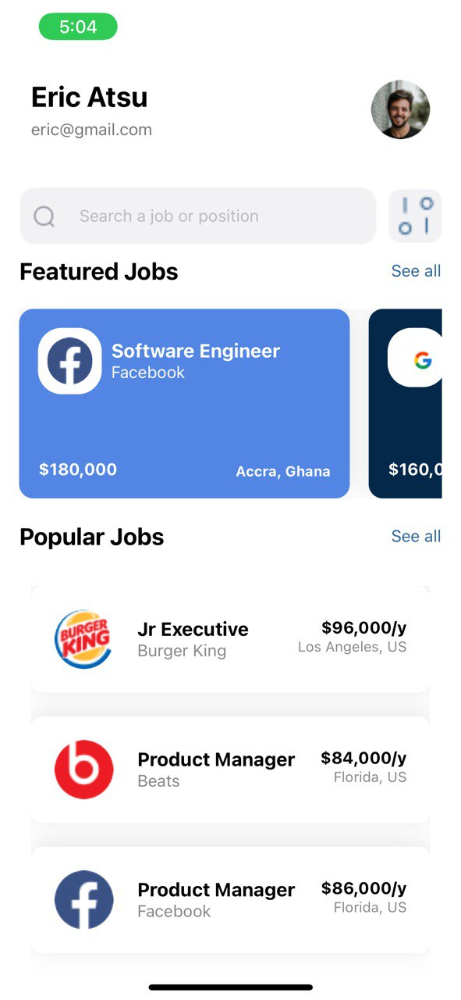

# rn-assignment4-11034645
**Job Application App**

This project is a simple job application app built using React Native. Some of the functions of this app are to help users explore featured and popular job listings, with detailed information on job titles, companies, locations, and salaries.

### Features:

- **Featured Jobs**: Display a list of featured job listings with unique background colors for different companies.
- **Popular Jobs**: Display a list of popular job listings with company logos.
- **Job Details**: Each job card displays the job title, company, location, and salary.
- **Horizontal Scroll**: Users can scroll horizontally through featured job listings.
- **Consistent Styling**: The app maintains consistent styling and layout across all job cards.

### Core Components Used:
- **View**: Used for creating the layout structure of screens and job cards.
- **Text**: Display text content such as job titles, company names, locations, and salaries.
- **ScrollView**: Scrollable container for displaying featured job lists.
- **Image**: Display company logos on job cards.
- **Stylesheet**: Used for styling the application components.
- **FlatList**: Render lists of popular jobs efficiently.

### Additional Dependencies:
- **react-native-gesture-handler**: Enables gesture handling capabilities in the app.
- **@react-navigation/native**: Provides navigation container for managing the navigation state.
- **@react-navigation/stack**: Enables stack-based navigation for transitioning between screens.

### Screenshot Of Application:

### Installation:

To run this application locally:

1. Clone this repository.
   
2. Navigate to the project directory and run `npm install` to install dependencies.
   
3. Run `npm start` to start the Metro Bundler.
   
4. Scan the QR code using the Expo Go app on your mobile device or run the application on an emulator.

### Technologies Used:

- React Native
- Expo
- JavaScript
- react-native-gesture-handler
- @react-navigation/native
- @react-navigation/stack

## Student ID
11034645